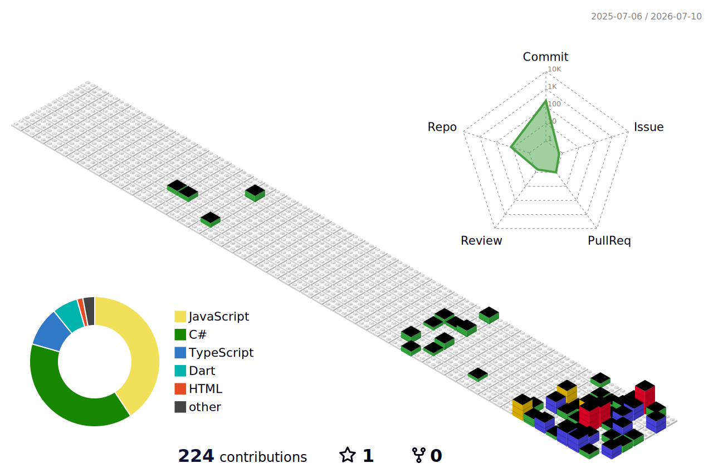

### 3D Contribution Graph

  

# Hi there, I'm Bùi Ngọc Tâm

I am a Software Engineering student at FPT University with a strong focus on full-stack development, system architecture, and game development.

---

### Objectives
* **Short-term:** Master C#, OOP, System Design, and build robust applications.
* **Long-term:** Become a Software Engineer specializing in Backend Development and System Architecture.

---

### Tech Stack & Tools
* **Languages:** C#, Java, JavaScript
* **Frameworks:** .NET (Core/Framework), WPF, ASP.NET MVC/Core, React, Java Web (Servlet/JSP)
* **Databases:** SQL Server, PostgreSQL, MySQL
* **Tools & Concepts:** Visual Studio, Git, OOP, MVC, MVVM, Unity

---

### Featured Projects

**1. AI Mock Interviewer**
* A comprehensive platform designed to simulate job interviews.
* Integrated AI voice and chat APIs to create dynamic, real-time interactions and feedback for users.

**2. C# WPF Bookstore Management**
* Developed a desktop application featuring multiple screens (Book List, Sales, Reports).
* Applied strict OOP principles and the MVVM pattern for clean architecture.
* Designed UI using XAML with proper data binding and utilized SQL Server for data management.

**3. Online Learning Management System (OLMS) & Course Enrollment**
* Designed detailed Entity-Relationship Diagrams (ERD) and developed backend modules for a system supporting students, instructors, and admins.
* Built entirely from scratch utilizing ASP.NET Core with robust notification management and response routing.

**4. 3D Chess Game**
* Developed a multiplayer 3D chess environment using the Unity engine.
* Integrated Photon-based networking for multiplayer lobbies and implemented custom game modes (e.g., "Scorched Earth").

**5. Java Web Student Management**
* Built a web-based system handling CRUD operations for student data.
* Implemented authentication, role-based access, and deployed locally via Tomcat server.

---

### Let's Connect
* **Email:** buingoctam06042003@gmail.com
* **Phone:** 0974867471
* **Location:** Thu Duc, TPHCM
