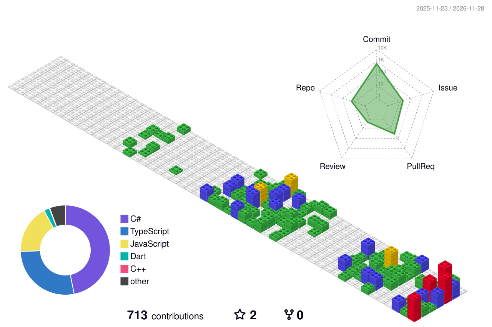

  
  
Software Engineering Student at FPT University

  

---

### About Me

Backend & Full-stack developer focused on building scalable systems, clean architecture, and modern web applications. Currently diving deeper into distributed systems, microservices, and DevOps.

---

### Core Stack

  

  <b>Backend:</b> ASP.NET Core, EF Core, SignalR  •  <b>Database:</b> SQL Server, PostgreSQL  •  <b>Frontend:</b> React, Vite, Tailwind CSS

---

### 3D Contributions

  <picture>
    <source media="(prefers-color-scheme: dark)" srcset="profile-3d-contrib/profile-night-view.svg" />
    <source media="(prefers-color-scheme: light)" srcset="profile-3d-contrib/profile-gitblock.svg" />
    
  </picture>

---

  <a href="mailto:buingoctam06042003@gmail.com">buingoctam06042003@gmail.com</a>  •  Ho Chi Minh City, Vietnam

